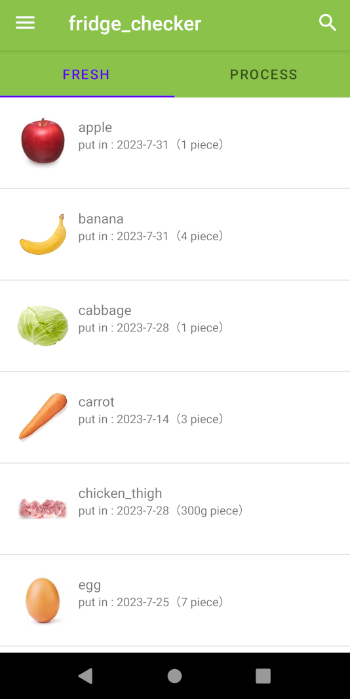
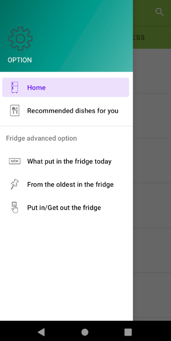
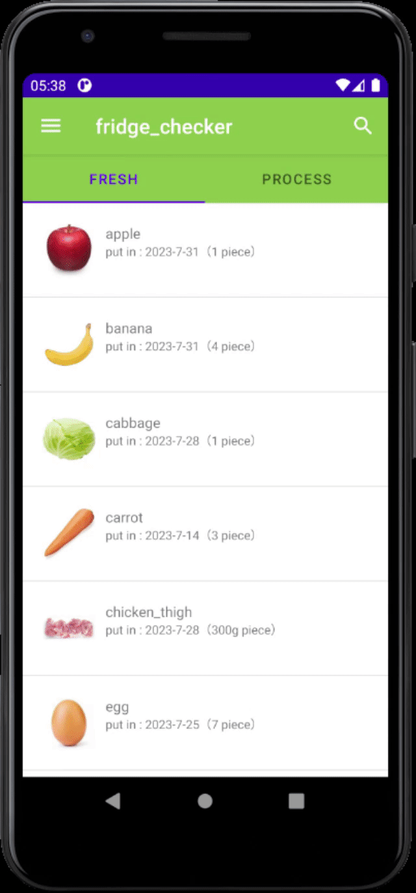
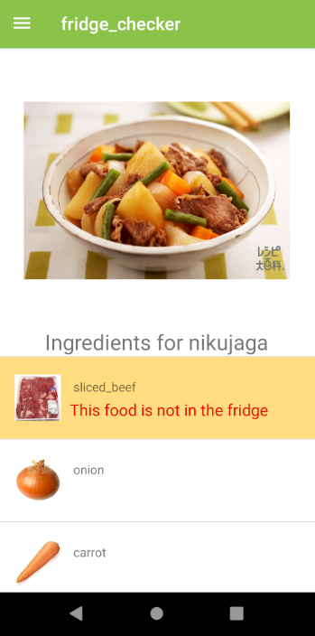
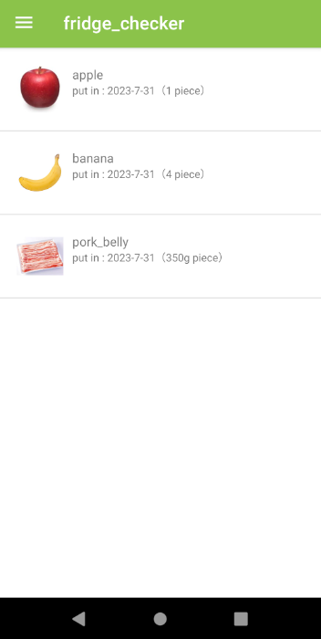
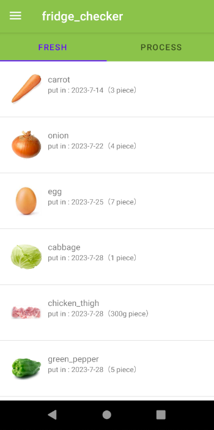

## 冷蔵庫に入っている飲食物を管理するandroidアプリ

冷蔵庫に入っている飲食物をスマホから確認できるandroidアプリです。

### ホーム画面

基本機能としては、
1. 生鮮食品と加工食品でタブ分けし、少ないスクロールで飲食物を確認しやすくした機能

2. 献立を考えてくれる機能（未完成）

3. "今日"、スーパー等で購入した飲食物を表示する機能

4. 冷蔵庫に入っている飲食物を古いもの順にソートする機能

5. 冷蔵庫への出し入れをカメラで管理する機能（未完成）

があります

## 作った背景

ハッカソンで、「冷蔵庫に入っている飲食物を腐らせることなく消費する」というアイディアの元にアプリを作成しました。サービスとして運用するつもりはなかったので、androidアプリ（Kotlin）のみ実装済みです。

## 基本機能

### 機能のリスト（上から1、2、3、4、5の順）

## 1. 生鮮食品と加工食品でタブ分けし、少ないスクロールで飲食物を確認しやすくした機能

FRESHとPROCESS、二つのタブを用いて飲食物を分割しました。分割することにより、少ないスクロールで飲食物を確認しやすくしました。また、検索アイコンを押すことにより飲食物の名前で前方一致検索ができます。

### デモ（GIF）

## 2. 献立を考えてくれる機能（未完成）

献立を考えてくれる機能となっており、食のジャンルは和食、洋食、中華、韓国の4種類あります。食べたいジャンルを選択すると献立が表示され、冷蔵庫に足りない食品に関しては赤くハイライトされます。未完成な部分は、レシピの表示、献立の種類、献立の推薦システム等です。

### デモ

   
  
  

## 3. "今日"、スーパー等で購入した飲食物を表示する機能

"今日"、スーパー等で購入した飲食物を表示する機能となっており、同居人で同じものを複数買ってしまうことを防ぐ目的で実装しました。

## 4. 冷蔵庫に入っている飲食物を古いもの順にソートする機能

冷蔵庫に入っている飲食物を古いもの順にソートする機能となっており、古い食品を腐らせず使用することを目的として実装しました。

## 5. 冷蔵庫への出し入れをカメラで管理する機能（未完成）

冷蔵庫への出し入れをカメラで管理する機能となっていますが、未完成なため動作しません。ただし、飲食物が更新される機能はFirebaseのRealtime Databaseを使用して実装しています。データ構造のサンプルはsample.jsonとなっております。

## 最後に

初めてandroidアプリを作成したためUI/UXの出来がよくありません。特に、コードについては可読性がとても低いものとなっています。また、カメラとの連携機能等バックエンド側の処理を実装していないため、冷蔵庫管理アプリとして使えることができません。
